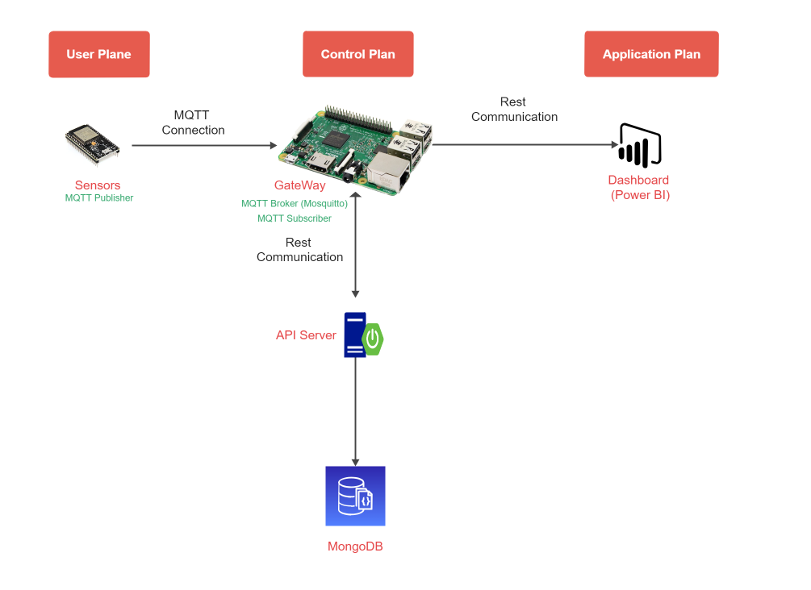

HeathMonitor est un système conçu pour la télémédecine des patients COVID. 

Le système est composé d'un ensemble de dispositives médicaux connectés par à une passerelle qui diffuse les données vers une plateforme de visualisation de données "Power BI"

celon l'architechture ci dessous : 

Auteurs : bendahouwael & waelmhimdi77

